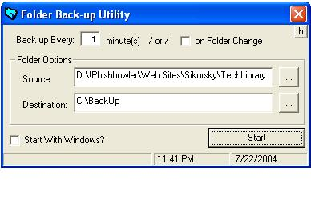



## Folder Backup Utility

### Description

Automatically Backs up a folder by synchronizing the contents to a destination folder. Looking for easy way of synching folders? Want a utility that will instantly back up your files when specified? This utility is for you. Not only will it use an incremental back up method to secure your files but it can back up your folder when a change is made to the directory. Demonstrates file synch and folder watching for changes much like Norton Anti virus. This application will load with windows to ensure that your folder is backed up automatically from the start. Sits in the task bar as a small folder icon.

Keywords: Auto Backup Backing up Back up Copy Sync Synch Synchronize Incremental Differential Folder File Transfer Taskbar Icon Registry Load with Windows GetSetting SaveSetting Destination Source Directory Norton Anti-Virus
 
### More Info
 
If you have trouble downloading try here http://www.dreamstruct.com/folderbackup.zip

             |
---                |---
**Submitted On**   |2004-07-22 23:33:42
**By**             |[Dreamcoding](https://github.com/Planet-Source-Code/PSCIndex/blob/master/ByAuthor/dreamcoding.md)
**Level**          |Intermediate
**User Rating**    |4.6 (55 globes from 12 users)
**Compatibility**  |VB 6\.0
**Category**       |[Files/ File Controls/ Input/ Output](https://github.com/Planet-Source-Code/PSCIndex/blob/master/ByCategory/files-file-controls-input-output__1-3.md)
**World**          |[Visual Basic](https://github.com/Planet-Source-Code/PSCIndex/blob/master/ByWorld/visual-basic.md)
**Archive File**   |[Folder\_Bac1775137282004\.zip](https://github.com/Planet-Source-Code/dreamcoding-folder-backup-utility__1-55114/archive/master.zip)

